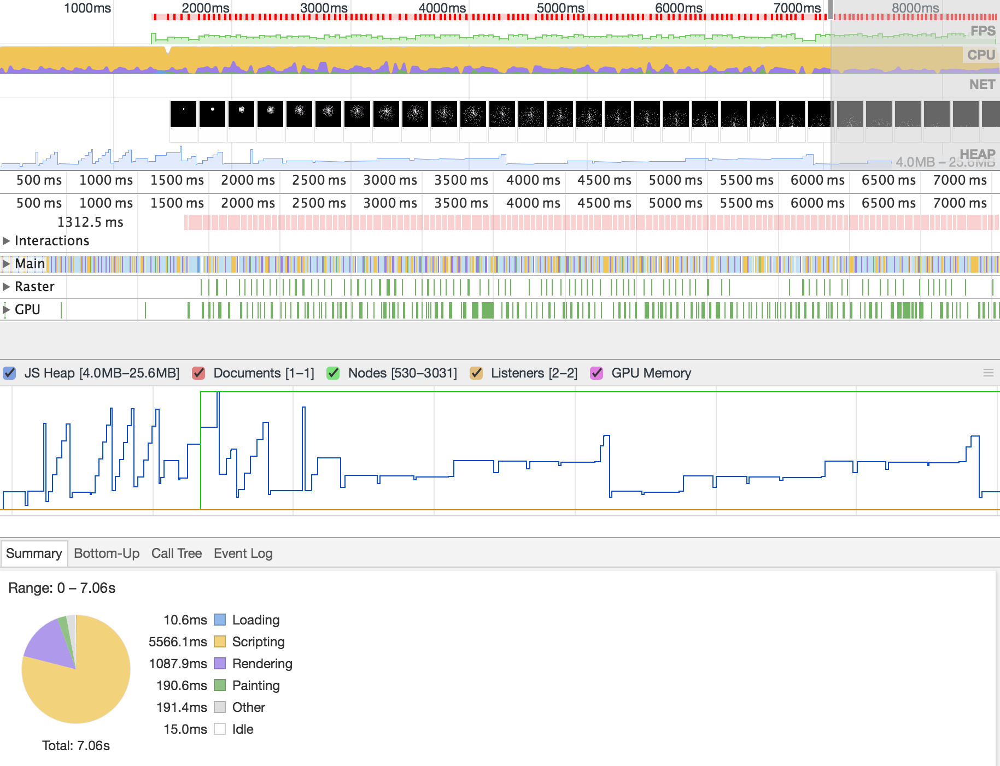

## [Chrome Timeline](https://segmentfault.com/a/1190000006224653)
> 遇到一些低效代码，严重影响页面运行的效率，此文讨论如何去优化。
### Timeline面板

#### 从上到下依次是：
- 缩略图（FPS、CPU、NET、HEAP(堆栈占用)）
- 区域二
    + Interactions：交互事件
        如：`input Event:mouse down | up | move`
    + Main
    + Raster
    + GPU
- 区域三是具体的事件列表

#### 最低要求
> 一般而言，60FPS === 16ms/F，同时，浏览器除了执行代码之外，还有css计算、音频播放等任务，因此时间控制在10ms~12ms比较好

#### 优化方法
- 减少DOM计算，将数据存在内存数组中
- 减少不必要的计算
- 用`requestAnimationFrame`替换setInterval
- 避免反复查找元素

## 网页性能管理详解
[@阮一峰](http://www.ruanyifeng.com/blog/2015/09/web-page-performance-in-depth.html)
> 性能差的网页：响应慢、占大量CPU和内存、浏览卡顿、动画不流畅...

### 网页的生成（五部）
- HTML->DOM tree
- CSSOM tree (CSS Object Model)
- DOM + CSSOM 合成 Render tree(包含每个节点的视觉信息)
- layout（生成布局）：将每个节点在一个平面上合成（计算位置...）
- paint（将布局绘制在屏幕上）
